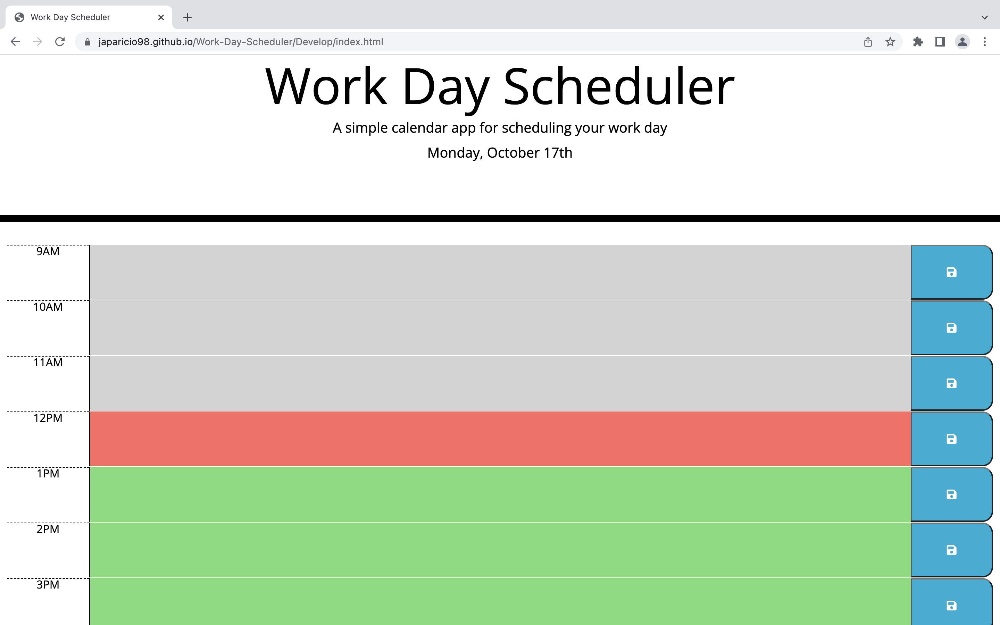

# Work-Day-Scheduler

## Description

This is a work day scheduler which allows a user to save events for each hour of the day. The scheduler includes color coded blocks which will change color based on the hour when the user loads the webpage. The scheduler will also retain saved events when the webpage is refreshed or revisited. 


## Requirements

The business requirements include the following:

GIVEN I am using a daily planner to create a schedule
- WHEN I open the planner THEN the current day is displayed at the top of the calendar
- WHEN I scroll down THEN I am presented with time blocks for standard business hours
- WHEN I view the time blocks for that day THEN each time block is color-coded to indicate whether it is in the past, present, or future
- WHEN I click into a time block THEN I can enter an event
- WHEN I click the save button for that time block THEN the text for that event is saved in local storage
- WHEN I refresh the page THEN the saved events persist


## Installation

N/A


## Deliverables

The Work Day Scheduler HTML can be found at ```./Develop/index.html``` with an accompanying CSS file at ```./Develop/assets/style.css``` and a JS file at ```.Develop/assets/script.js```.

The finished product can be found here: [https://japaricio98.github.io/Work-Day-Scheduler/Develop/index.html](https://japaricio98.github.io/Work-Day-Scheduler/Develop/index.html)

Screenshots of the finished product appear below.




## Credits

Juan Aparicio


## License 

MIT License
